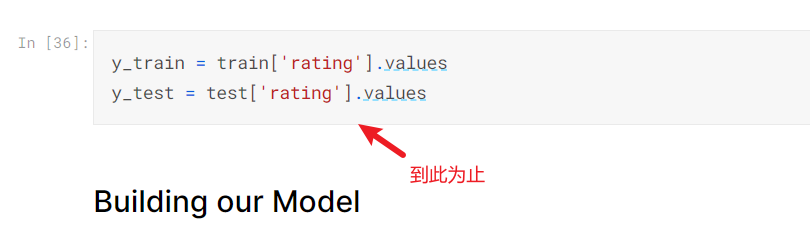
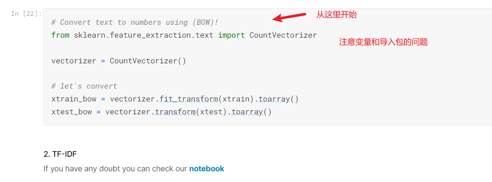
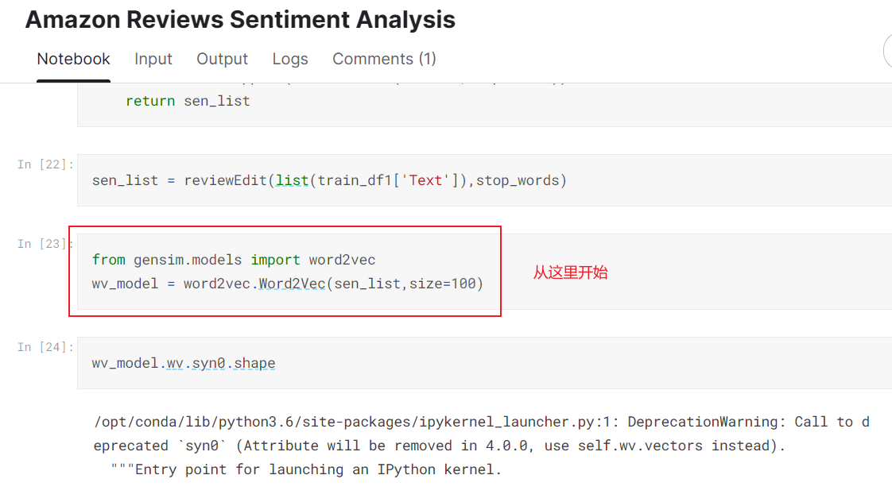

# 参考网址

数据来源：https://www.kaggle.com/datasets/meetnagadia/amazon-kindle-book-review-for-sentiment-analysis

KNN: [KNN](https://www.kaggle.com/code/nishankbhola/knn-amazon-sentimental-analysis)

逻辑回归(更新)： [逻辑回归](https://www.kaggle.com/code/meetnagadia/sentiment-analysis-on-amazon-kindle)

LSTM+GRU(不是首选推荐,就参考即可): [LSTM+GRU](https://www.kaggle.com/code/dijiswiki/lstm-gru-sentiment-analysis-on-amazon-review)

Bag of Words（词袋技术） and TF-IDF  [SentimentAnalysis | Kaggle](https://www.kaggle.com/code/aravindanr22052001/sentimentanalysis)

因为我们已经进行向量化了，所以不需要使用pytorch.embedding，上面LSTM参考文章里面使用了这个技术，我们直接调用相应的模型即可。
BOW 和IF-TDF 参考：https://stackoverflow.com/questions/76119942/how-to-use-tfidf-matrix-in-lstm-in-pytorch
word2vec 参考: https://stackoverflow.com/questions/49710537/pytorch-gensim-how-do-i-load-pre-trained-word-embeddings/49802495#49802495
word2vec核心就是将自己已经处理好的数据作为权重直接作为到embedding 层即可，pytorch中RNN的必须要有pytorch.embedding层作为其他RNN训练的基础，关键在于只要拟合好embedding层即可，维度为 batch_size * 一个句子的长度 * 每个句子每个位置的词向量

# 系统架构

- 数据预处理：将训练数据和测试数据导出到本地 csv 格式。
- 模型训练：导入处理后的数据，根据 python 模型进行训练，最后导出模型。
- 模型测试：选择模型文件，导入模型，导入测试集，测试数据。

## 架构细节

细节要自己理解了写，方式：**注释写中文**，描述语句的作用。

### 数据预处理

任务一_简单数据预处理：
1. 参考`逻辑回归`文章，直接导入部分处理好的数据（就是发的csv格式文件）。使用这个文档中的图表分析，一直参考到 **Building our Model** 之前的部分。**不要做切分数据集的操作，因为后面word2vec需要将全部文本变为向量形式之后再切分**
    

注意：nltk 中 stopwords 需要提前下载文档中没有，需要自己加上，同理wordnet也是如此

```python
import nltk
nltk.download('stopwords')
nltk.download('wordnet')

# 下面为具体使用
from nltk.corpus import stopwords
stoplist = set(stopwords.words("english"))
```


任务二_三种技术完成单词向量化：
1. 参考`词袋技术`文章（注意变量使用是否相同的问题，因为跨文了），从**Bag of Words**开始参考，`import`库的也要注意，防止找不到包。(下图位置不太对，这个时候再切分数据集，但是不能覆盖原来数据集变量，因为word2vec需要使用原来的进行整体训练词向量)
   
2. 以上完成的是`词袋技术`和`IF-TDF`，之后需要参考`word2vec使用参考`文章【这部分可以我来做】
3. 将上面三种技术得到的训练数据和测试数据导出到本地 csv 格式。

word2vec 使用细节：一直可以参考到切分数据集结束


### 模型训练

如果已经处理好数据了，可以直接导入数据然后训练模型，因为输入已经标准化为数值类型，直接调用已有的开源模型即可。

传统机器算法基本都可以使用sklearn库中的模型，例如逻辑回归, KNN等等。参考上面API调用，知道如何传数据即可。

深度学习算法可以使用pytorch（不推荐tensorflow），这个API调用更加简单便捷。

最后将训练好的模型保存为pickle文件，方便后续调用。

### 模型测试

模型测试部分，需要导入模型文件，然后导入测试集，测试数据。

使用的评价指标为：召回率、F1及ROC曲线。都要有图表展现

BOW 和 IDF 只能使用在传统机器学习算法中，深度学习算法只能使用word2vec。

黄加宇来负责写word2vec的部分，用于神经网络.

# TODO任务：

数据预处理：
- [x] 任务一_简单数据预处理
- [x] 任务二_三种技术完成单词向量化(word2vec可以留给我完成)

模型训练：
- [ ] 任务一_逻辑回归
- [ ] 任务二_K近邻算法KNN
- [ ] 任务三_深度学习算法LSTM
