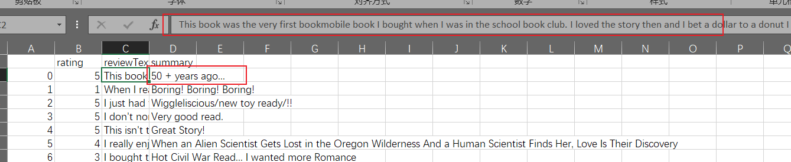
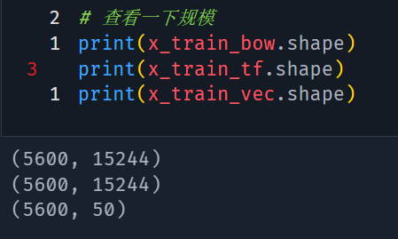
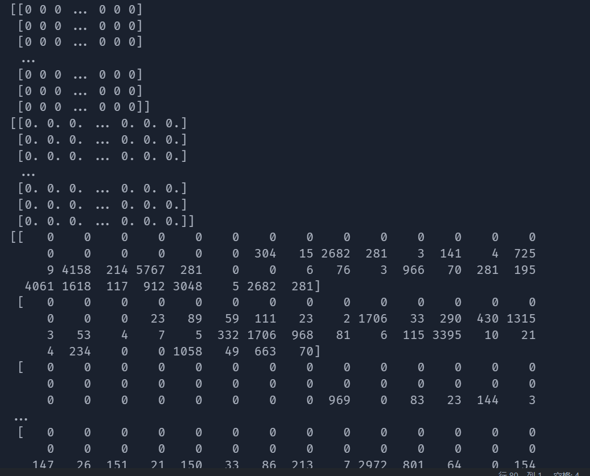
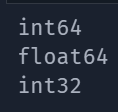
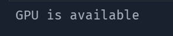
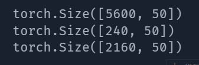
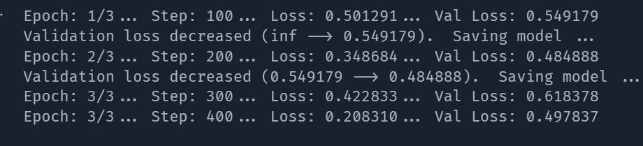
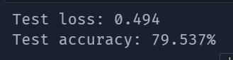
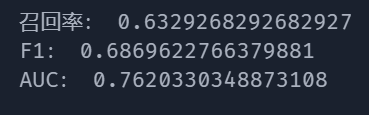
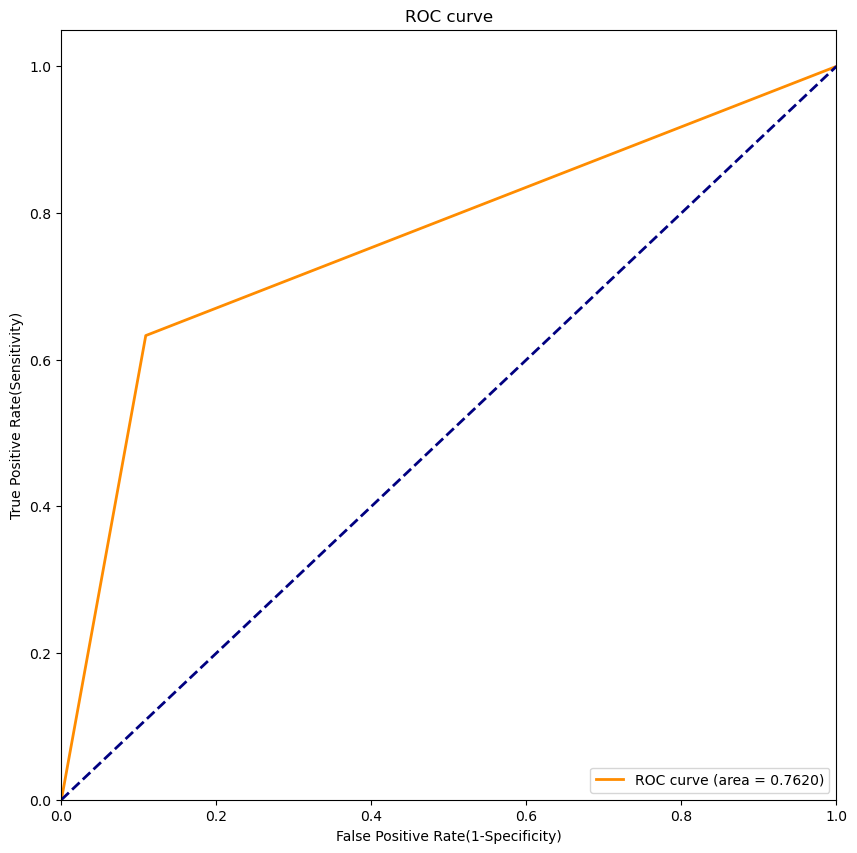

# 分析数据集概述

## 数据来源

使用公开数据集,数据来源：`https://www.kaggle.com/datasets/meetnagadia/amazon-kindle-book-review-for-sentiment-analysis`

## 属性名称与属性类型

| 属性名称   | 属性类型 | 属性描述       |
| ---------- | -------- | -------------- |
| rating     | 整数     | 用户评分       |
| reviewText | 字符串   | 用户评论       |
| summary    | 字符串   | 用户评论的标题 |

## 数据规模

总行数：12000 条，大小为 7.4MB

## 数据样例

# 分析目标

在该数据集上完成情感分类，判断对书籍的评价是正向的还是负向的。

分别使用传统机器学习的 KNN，逻辑回归模型和深度学习的 LSTM 模型

# 设计

数据预处理：
1. 使用 Pandas 导入数据
2. 检测有无缺失值，如果有采用删除缺失值
3. 数据规范化
	1. 将评分小于 3 的定义为 0，大于等于 3 的定义为 1
	2. 所有英文采用小写
	3. 去除标点符号
	4. 去除无意义的 `stopword`
	5. 标准词性，留下有意义的单词
	6. 数据规约，删除部分文本量过大数据对象
4. BOW 技术，得到相应的向量
5. TF-IDF 技术，得到相应的向量
6. word2vec 准备：根据单词词典将每个单词变为词典的序号
7. 切分数据集：$70\%$ 作为训练集，$30\%$ 作为测试/验证集

LSTM建模步骤：
1. 定义 LSTM 模型，设定输入层，embedding 层，隐藏层，输出层。其中 embedding 层使用 word2vec 技术，将每个单词变为相应的词向量。
2. 设定循环训练次数
3. 开始训练，达到一定次数后使用验证集验证数据，保留最好的模型
4. 使用准确率初步测试，方便参数调优

- [ ] TODO： KNN 和逻辑回归，这部分不用写具体操作，只需要将关系思路和步骤写出来，如何处理数据的细节在后面实现中写。

# 实现

## 数据预处理

- [ ] TODO： 你对照上面的预处理设计，详细写一下即可，代码就不用复制，就说明相应思路和使用的 API 函数什么即可。处理结果截图。

## 数据建模

### 读取训练数据

首先读入文件，将序号化的文本读入，即读入 `word2idx.pkl` 文件

读入已经预处理好的文件，即 `processed_data` 文件夹下所有 `.npy` 后缀的文件。读取后查看数据规模

查看每个训练数据的前10行（分别为BOW，TF-IDF,word2vec预处理后的数据）

相应的类型为

### 逻辑回归

- [ ] TODO： KNN，逻辑回归建模

### KNN

### LSTM 建模

#### 数据准备

开始选择GPU/CPU进行训练，这里选择使用 GPU 进行训练

将训练数据转换为 `torch` 的 `tensor` 类型，然后打包为 `torch` 的 `dataset` 类型，方便后续使用 `dataloader` 进行批量训练。相当于一个batch的数据。

这里注意，由于最后一组batch的数量可能达不到batch_size，这会导致训练最后一组batch时出现错误，所以这里对于 `DataLoader` 类型使用 `drop_last=True`，即舍弃最后一组batch。

查看打包后数据规模

#### 构建 LSTM 网络

使用 `pytorch` 构建 LSTM 网络

构建参数如下

| 参数名称      | 参数含义                               |
| ------------- | -------------------------------------- |
| vocab_size    | 单词序号化之后的长度                   |
| output_size   | 输出的长度（因为就一个标签，所以是 1） |
| embedding_dim | 使用 word2vec 需要生成长度为多少的向量 |
| hidden_dim    | 隐藏层的维度                           |
| n_layers      | 使用网络的层数                         |
| drop_prob     | 正则化比例                                       |

使用 `Sigmoid` 函数作为激活函数，使用 `BCELoss` 作为损失函数,使用 `Adam` 作为优化器

## 模型训练结果

### LSTM训练

设定`epoch`的数量，开始训练,训练过程中使用验证集进行验证，保留最好的模型。每100次训练进行一次验证，如果验证集的准确率比之前的高，则保存模型

#### 测试网络

使用测试集进行测试，得到准确率（初步测试）。

可以看到训练后的准确率为 $79.537\%$，损失值为 $0.494$

- [ ] TODO： KNN, 逻辑回归

## 模型评估效果

### LSTM 网络评估

读取数据方式和上面一样，需要转为 `tensor` 类型，然后使用 `DataLoader` 进行打包，方便后续批量测试。不再赘述。

测试结果如下：

ROC曲线如下

- [ ] TODO： KNN, 逻辑回归

# 数据分析总结

> 注：总结分析工作的感悟与不足。
